:figure-caption: Рисунок
:toc:
:toc-title: Оглавление
== Отчет по курсовому проекту
=== Тема:  Разработка устройства активной системы охлаждения
=== Дисциплина: Программное обеспечение измерительных процессов

Выполнили:
----
Дергалёв Иван Дмитриевич КЭ-415
Федотов Никита Александрович КЭ-415
Тимиргазин Ильхам Марсельевич КЭ-415
----

== 1. Задание на курсовой проект

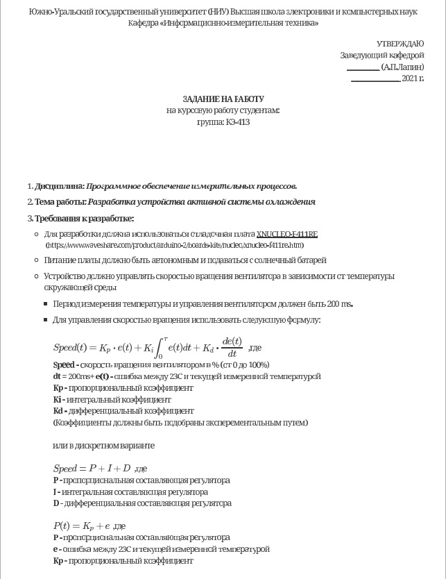
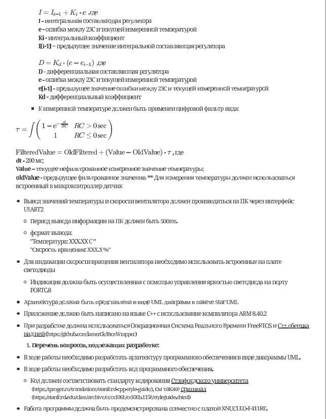
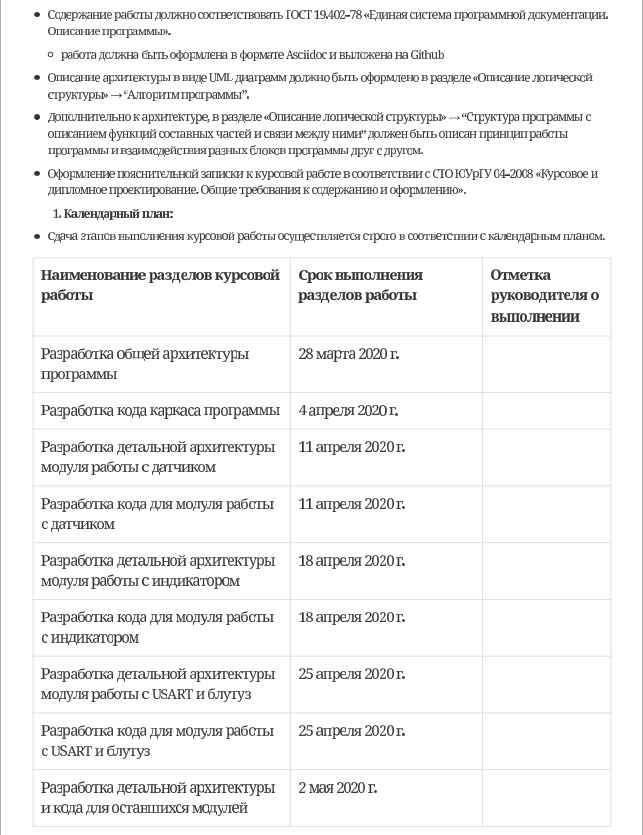
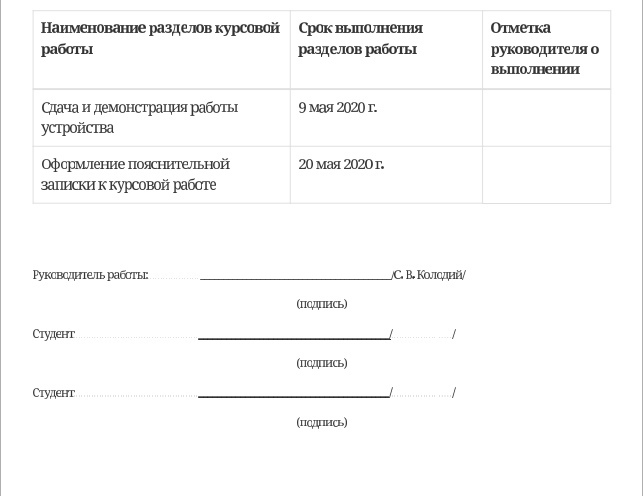

== 2. Требования которые подверглись изменению

* Для индикации скорости вращения вентилятора необходимо использовать встроенные на плате светодиоды
** Индикация должна быть осуществленная с помощью управления яркостью светодиода на порту PORTC.8

* В качестве вентилятора выступает управление яркостью светодиода, чем выше скорость, тем ярче горит светодиод.

* Температура изменяется в зависимости от изменения напряжения с помощю переменного резистора.

=== Введение

В вычислениях процессор или блок обработки – это цифровая схема, которая выполняет операции с некоторым внешним источником данных, обычно с памятью или каким-либо другим потоком данных. Обычно он представляет собой микропроцессор, который может быть реализован на одном кристалле интегральной схемы металл-оксид-полупроводник.

Микропроцессор – это компьютерный процессор, который объединяет функции центрального процессора на одной (или нескольких) интегральной схеме (ИС) конструкции MOSFET. Микропроцессор представляет собой многоцелевую цифровую интегральную схему на основе регистров, управляемую часами, которая принимает двоичные данные в качестве входных данных, обрабатывает их в соответствии с инструкциями, хранящимися в своей памяти, и предоставляет результаты (также в двоичной форме) в качестве выходных.

Микропроцессоры содержат как комбинационную логику, так и последовательную цифровую логику. Микропроцессоры работают с числами и символами, представленными в двоичной системе счисления.

Использование микропроцессоров в приборах стало общепринятым ввиду того, что микропроцессор может обрабатывать сигналы от нескольких датчиков сразу, сравнивать измеренные значения с номинальным значением и отображать результаты на экране визуального дисплея. Таким образом, микропроцессорные системы позволяют быстро и эффективно решать задачи управления данными и обработки результатов.

В то время как при аналоговом измерении общий диапазон измерения может быть разделен на 100 делений, с помощью цифровой электроники можно разбить его на 5000 частей, обеспечивая гораздо большую точность для того же диапазона измерения.
Микрокомпьютеры могут обрабатывать очень сложные комбинации сигналов без снижения точности [3].

== 3. Анализ требований

=== 3.1 Отладочная плата NUCLEO-F411RE

Плата представляет собой гибкую платформу, позволяющую разработчикам реализовать собственные идеи и в кратчайшие сроки сделать прототип будущего изделия.

На плате установлен микроконтроллер STM32F411RET6 с ядром ARM Cortex-M4, работающий на частоте до 100 МГц. Высокая производительность, низкое энергопотребление, богатая аналоговая и цифровая периферия, поддержка множества коммуникационных интерфейсов делают микроконтроллер идеальным для широкого спектра приложений.

Отладочная плата поддерживает подключение плат расширения модулей, совместимых с Arduino и ST Morpho. Обновленная версия интегрированного эмулятора ST-LINK/V2-1 избавляет от необходимости использовать внешний программатор-отладчик. Полная программная поддержка, доступность различных библиотек, примеров и демо-приложений позволяют упростить и ускорить разработку пользовательских приложений.

[cols="a, a"]
|===
| * *STM32F411RET6 ядро:* ARM® 32-bit Cortex™-M4 |  * *CP2102:* USB - UART преобразователь
| * *Arduino разъем:* для подключения Arduino шилдов ​| * *ICSP interface:* Arduino ICSP
| * *USB разъем:* USB коммуникационный интерфейс| * *SWD interface:* для программирования и отладки
| * *ST Morpho разъемы:*  для упрощения расширения​| * ​*6-12 V DC вход питания*
| * *Пользовательская кнопка* | *​ *Кнопка Сброса*
| * *Индикатор питания* | * *Пользовательские светодиоды*
| * *Индикаторы последовательного порта Rx/Tx* ​| *8 MHz кварцевый резонатор*
| * *32.768 KHz кварцевый резонатор* | http://www.waveshare.com/xnucleo-F411RE.htm
|===

.Отладочная плата
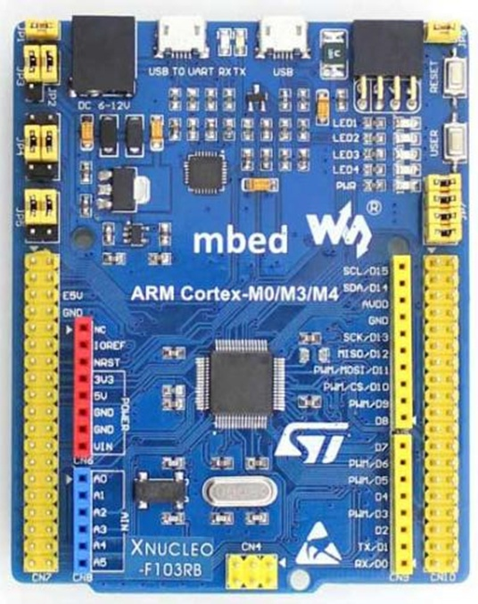

=== 3.2 Характеристики микроконтроллера
[.notes]
--
Микроконтроллер имеет следующие характеристики:
--
[cols="a, a"]
|===
| *	32 разрядное ядро ARM Cortex-M4 | *	Блок работы с числами с плавающей точкой FPU
| *	512 кБайт памяти программ | *	128 кБайт ОЗУ
| * Встроенный 12 битный 16 канальный АЦП | *	DMA контроллер на 16 каналов
| *	USB 2.0 | *	3x USART
| * 5 x SPI/I2S | * 3x I2C
| * SDIO интерфейс для карт SD/MMC/eMMC | * Аппаратный подсчет контрольной суммы памяти программ CRC
| *	6 - 16 разрядных и 2 - 32 разрядных Таймера | *	1 - 16 битный для управления двигателями
| *	2  сторожевых таймера | *	1 системный таймер
| *	Работа на частотах до 100Мгц |* 81 портов ввода вывода
| *	Питание от 1.7 до 3.6 Вольт | * Потребление 100 мкА/Мгц
|===

=== 3.3 Особенности микроконтроллера

*	Настраиваемые источники тактовой частоты;
*	Настраиваемые на различные функции порты;
*	Внутренний температурный сенсор;
*	Таймеры с настраиваемым модулем *ШИМ*;
*	*DMA* для работы с модулями (*SPI*, *UART*, *ADC*… );
*	12 разрядный *ADC* последовательного приближения;
*	Часы реального времени;
*	Системный таймер и спец. прерывания для облегчения и ускорения  работы *ОСРВ*.

=== 3.4 Плата расширения

.Плата расширения
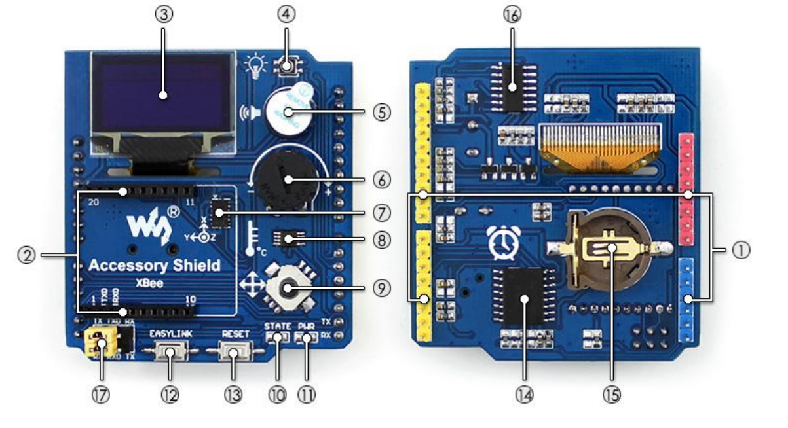

На плате имеются следующие элементы

1. Интерфейс под Arduino
2. Интерфейс под XBee
3. OLED дисплей
4. RGB светодиод
5. Зуммер
6. Переменный резистор на 10 кОм
7. Трёх осевой акселерометр ADXL345
8. Датчиик температуры LM75BDP
9. Пяти позиционный джойстик
10. Статус-индикатор XBee
11. Индикатор питания
12. Кнопка XBee EASYLINK
13. Кнопка сброса XBee и Arduino
14. Часы реального времени DS3231
15. Батарейка CR1220
16. RGB LED драйвер P9813
17. Джампер

=== 3.5 Переменный резистор

*Переменный резистор*  — это регулируемые делители напряжения, которые предназначены для регулирования напряжения при неизменной величине тока.

Снимаемое с подвижного отводного контакта потенциометра напряжение может изменяться от нуля до максимального значения, равного приложенному к потенциометру напряжению, в зависимости от текущего положения подвижного контакта.

.Схема работы переменного резистора
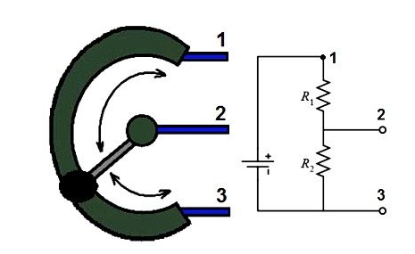

Согласно схеме платы расширения переменный резистор находится на линии *PA0* и имеет номинал *10 кОм*.

.Потенциометр на схеме
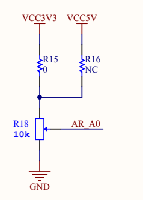

Предположим, что на нашей плате стоит переменный резистор с линейной функцией преобразования. Тогда используя точный мультиметр измерим напряжение и затем по формуле для расчета напряжения, которая приведена ниже определим точное напряжение по двум точкам.

Формула для расчета напряжения, получаемого с АЦП:

_U_ = _k_ * _data_ + _b_,

где _data_ - код, который мы получили с ADC;

_k_ - коэффициент угла наклона прямой;

_b_ - смещение прямой по оси абцисс.

=== 3.6 Аналогово-цифровой преобразователь

Аналогово-цифровой преобразователь — это устройство, преобразующее входной аналоговый сигнал в дискретный код (цифровой сигнал).
Обратное преобразование осуществляется при помощи цифро-аналогового преобразователя (ЦАП, DAC).
Как правило, АЦП — электронное устройство, преобразующее напряжение в двоичный цифровой код.

12-разрядный АЦП представляет собой аналого-цифровой преобразователь последовательного приближения.
Он имеет до 19 мультиплексированных каналов, что позволяет ему измерять сигналы от 16 внешних источников, двух внутренних источников и канала VBAT.
Aналого-цифровое преобразование каналов может выполняться в одиночном, непрерывном, сканирующем или прерывистом режиме.
Результат работы АЦП сохраняется в 16-разрядном регистре данных, выровненном по левому или правому краю.
Функция аналогового сторожевого таймера позволяет приложению определять, превышает ли входное напряжение заданные пользователем более высокие или более низкие пороговые значения.

.Последовательное приближение
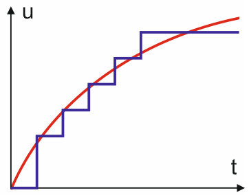

=== 3.7 Светодиод

Светодиод - это полупроводниковый прибор с электронно-дырочным переходом, создающий оптическое излучение при пропускании через него электрического тока в прямом направлении.

.Светодиоды на плате
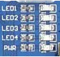

=== 3.8 USART

USART - Универсальный синхронный асинхронный приемник-передатчик (USART) предлагает гибкие средства полнодуплексного обмена данными с внешним оборудованием, требующим стандартного отраслевого формата асинхронных последовательных данных NRZ. USART предлагает очень широкий диапазон скоростей передачи в бодах с использованием генератора дробной скорости передачи в бодах. Он поддерживает синхронную одностороннюю связь и полудуплексную однопроводную связь. Он также поддерживает LIN (локальную сеть межсоединений), протокол смарт-карт и IrDA (инфракрасная передача данных), спецификации ENDEC и операции модема (CTS / RTS). Это позволяет осуществлять многопроцессорную связь. Высокоскоростная передача данных возможна при использовании DMA для конфигурации с несколькими буферами.

.Разъём для USART
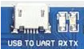

=== 3.9 DMA

DMA - прямой доступ к памяти (DMA) используется для обеспечения высокоскоростной передачи данных между периферийными устройствами и памятью, а также между памятью и памятью.
Данные могут быть быстро перемещены с помощью DMA без каких-либо действий процессора. Это позволяет освободить ресурсы процессора для других операций.Контроллер DMA сочетает в себе мощную архитектуру двойной главной шины AHB с независимым FIFO для оптимизации пропускной способности системы на основе сложной архитектуры матрицы шин.
Два контроллера DMA имеют в общей сложности 16 потоков (по 8 на каждый контроллер), каждый из которых предназначен для управления запросами доступа к памяти от одного или нескольких периферийных устройств.
Каждый поток может иметь в общей сложности до 8 каналов (запросов).
И у каждого есть арбитр для обработки приоритета между запросами DMA.

.Работа DMA

Плата имеет два двухпортовых DMA общего назначения (DMA1 и DMA2) с 8 каналами каждый.
Оба DMA канала расположены на шине AHB1 на который подаётся тактирование,
подняв биты DMA1EN и DMA2EN в регистре RCC_AHB1ENR.

.Регистр AHB1
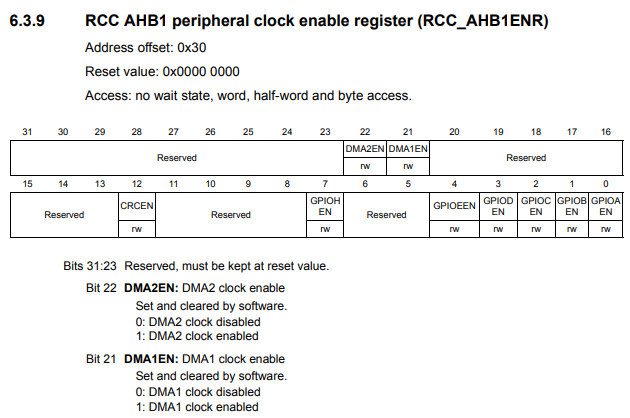

DMA (direct memory access), прямой доступ к памяти, используется для обеспечения высокоскоростной передачи данных между периферийными устройствами и памятью, а также для копирования данных из одной области памяти в другую.
Процесс пересылки данных с помощью DMA не требует каких-либо действий от процессора и освобождает его ресурсы для выполнения других операций.

Каждая передача DMA состоит из 3-х операций:

 * Загрузка данных из регистра периферийного модуля или адреса в памяти через внутренний регистр.

 * Сохранение данных, загруженных во внутренний регистр в указанное место. Им может быть периферийный модуль или адрес в памяти.

 * Увеличение адресов источника и приемника при необходимости.

=== 3.10 ШИМ

Широтно-импульсная модуляция — процесс управления мощностью методом пульсирующего включения и выключения потребителя энергии.
источники питания. Используется для плавного изменения яркости светодиода.

Сигнал, промодулированный по ширине импульса, формируется двумя способами:

* аналоговым;
* цифровым.

При аналоговом способе создания ШИМ-сигнала несущая в виде пилообразного или треугольного сигнала подается на инвертирующий вход компаратора, а информационный – на неинвертирующий.
Если мгновенный уровень несущей выше модулирующего сигнала, то на выходе компаратора ноль, если ниже – единица. На выходе получается дискретный сигнал с частотой, соответствующей частоте несущего треугольника или пилы, и длиной импульса, пропорциональной уровню модулирующего напряжения.

.Модуляция по ширине импульса треугольного сигнала линейно-возрастающий
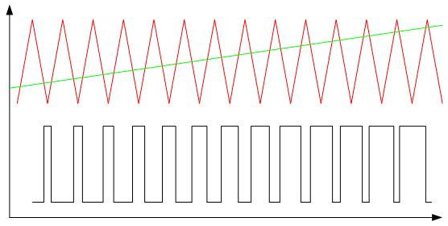

Коэффициента заполнения D (он же duty cycle).
Этот коэффициент равен отношению периода ШИМ сигнала к ширине импульса:

_D_ = _T_ / _tвкл_,

Пример ШИМ сигнала для разных значений D:

.Пример ШИМ сигнала для разных значений D
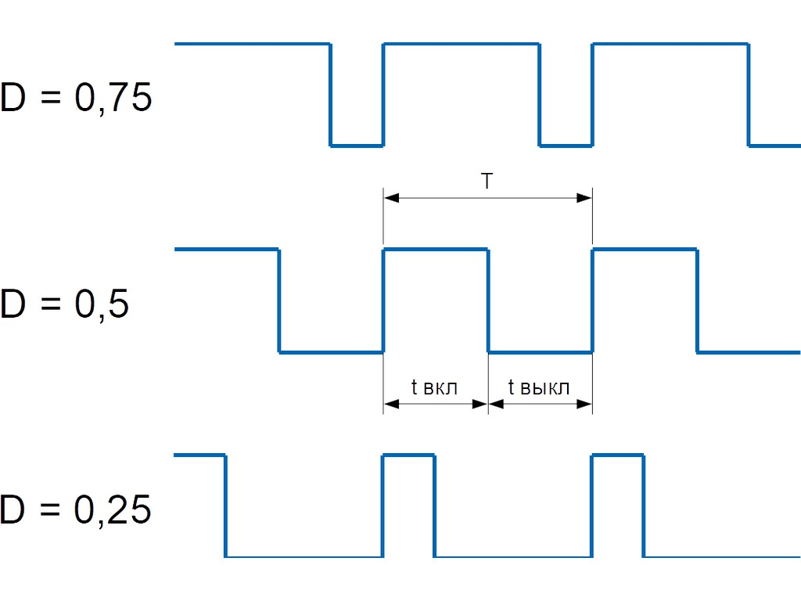

Чем больше D, тем больше мощности мы передаем управляемому устройству, например, двигателю.
Так, при D = 1 двигатель работает на 100% мощности, при D = 0,5 — наполовину мощности, при D = 0 — двигатель полностью отключен.

Виды напряжений разделяются на две группы:

 * постоянное;
 * переменное (этот вид напряжения имеется в цепях с синусоидальным и переменным токами)
В случае синусоидального тока рассматриваются такие
характеристики напряжения, как:

- амплитуда колебаний напряжения - это максимальное его отклонение от оси абсцисс;

- мгновенное напряжение, которое выражается в определенный момент времени;

- действующее напряжение, определяется по выполняемой активной работе 1-го
полупериода;

- средневыпрямленное напряжение, определяемое по модулю величины выпрямленного
напряжения за один гармонический период.

Величина постоянного напряжения или тока является его среднеквадратичным значением.
Среднеквадратичное значение переменного тока равно величине постоянного тока, действие которого произведёт такую же работу в активной (резистивной) нагрузке за время периода.
Определяющим фактором здесь является среднее (среднеарифметическое) значение мощности P avg или работы A avg, пропорциональное квадрату значения тока.

Среднеквадратичное значение напряжения – это такое значение переменного напряжения, при котором нагрузка потребляет столько же силы тока, как и при постоянном напряжении.
Также среднеквадратичное напряжение еще называют действующим или эффективным значением напряжения

.Среднеквадратичное напряжение
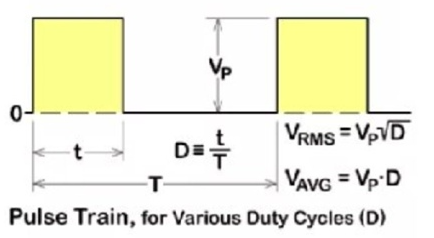

_Vrms_ = _Vp_ * _D^1/2_

_Vrms_ = _1_ * _0,75^1/2_ = 0,866

_Vrms_ = _1_ * _0,5^1/2_ = 0,707

_Vrms_ = _1_ * _0,25^1/2_ = 0,5

Кроме коэффициента заполнения для характеризации ШИМ применяют и другой параметр — скважность S.
Эти два параметра связаны выражением:

_S_ = _1_ / _T_,

Скважность, как и коэффициент заполнения — величина безразмерная.
В отличие от D, она может принимать значения от 1 до бесконечности.
Но чаще всего, особенно в англоязычных источниках, используют именно D.

Частота ШИМ определяет период импульса — T (см картинку выше). Требования к этой частоте диктуются несколькими факторами, в зависимости от типа управляемого устройства.

В случае управления светодиодами одним из главных факторов становится видимость мерцания.
Чем выше частота, тем менее заметно мерцание излучаемого света. Высокая частота также помогает снизить влияние температурных скачков, которые светодиоды не любят.
На практике для светодиодов достаточно иметь частоту ШИМ в пределах 100-300 Гц.

Ещё один важный параметр — разрешение ШИМ сигнала.
Этот параметр показывает, с какой точностью мы можем менять коэффициент заполнения.
Чем больше разрешение, тем плавнее будет меняться мощность на управляемом устройстве.

==== Разновидности ШИМ

По способам формирования сигнал с ШИМ можно разделить на пять родов.

В ШИМ первого рода (ШИМ-1) длительность импульса определяется значением сигнала в тактовые моменты времени

.Диаграмма формирования сигнала с ШИМ-1
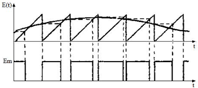

В ШИМ второго рода (ШИМ-2) фронт импульса совпадает с моментом выборки

.Диаграмма формирования сигнала с ШИМ-2
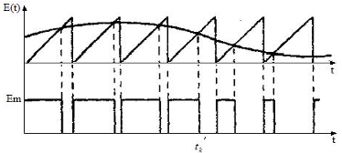

В ШИМ третьего рода (ШИМ-3) выборка производится в некоторый момент временивнутри импульса

.Диаграмма формирования сигнала с ШИМ-3
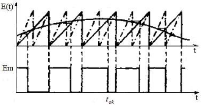

В ШИМ четвертого рода (ШИМ-4) выборка определяется функционалом от функции , определенном на интервале импульса.

В ШИМ пятого рода (ШИМ-5) выборка определяется функционалом от функции , определенном на тактовом интервале.

Наибольшее распространение в настоящее время имеют ШИМ-1 и ШИМ-2.

Важным моментом является то, что ШИМ любого рода может быть односторонней и двухсторонней

.Двухсторонний ШИМ
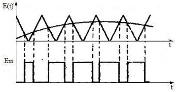

ШИМ любого рода можно подразделить однополярную нереверсивную (ОНМ), однополярную реверсивную (ОРМ) и двухполярную реверсивную (ДРМ). На примере ШИМ-2 в базисе разрывных функций на рисунке показаны модели сигналов во временной области для ОНМ, ОРМ и ДРМ

.Модели сигналов во временной области для ОНМ (а), ОРМ (б) и ДРМ (в)
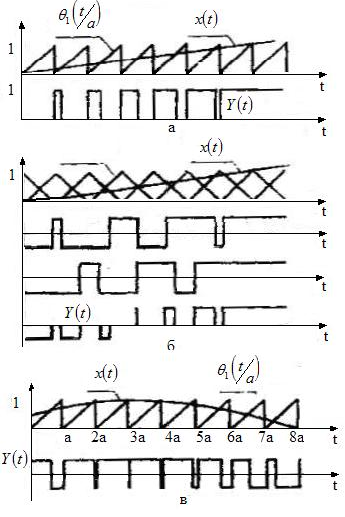

=== 3.11 ОСРВ

Операционные системы реального
времени (ОСРВ(RTOS)) предназначены для обеспечения
интерфейса к ресурсам критических по времени систем
реального времени. Основной задачей в таких системах
является своевременность (timeliness) выполнения
обработки данных".
Задачей ОСРВ является обеспечение реакции на
определенное действие за отведенный квант времени.
Для разных задач такой квант может иметь разное значение,
например, для обработки . Приблизительное время реакции в
зависимости от области применения ОСРВ может быть
следующее:

*  математическое моделирование - несколько микросекунд
*  радиолокация - несколько миллисекунд
*  складской учет - несколько секунд
*  управление производством - несколько минут

.Принцип работы ОСРВ
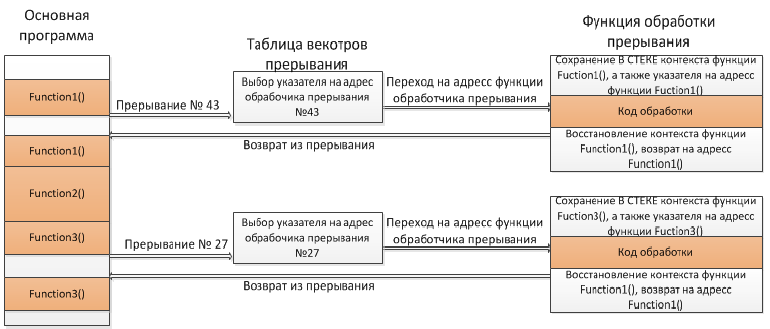

=== 3.12 PID-регулятор

PID-регулятор один из самых распространнёных автоматических регуляторов, применяется практически везде где нужно автоматическое управление.

В нашем случае, применяется для регулировании скорости.

_P_-составляющая - эта составляющая представляет собой разность текущего значения с датчика и установки, данная разница называется ошибка регулирования, то есть на сколько далеко находится система от заданного значения.

_I_-составляющая - составляюща которая просто суммирует в саму себя, ту же самую ошибку, разность текущего и заданного значения, умноженную на период дискритезации системы.

_D_-составляющая - составляющая представляет собой разность текущей и предыдущей ошибки, поделенную на время между измерениями

При увеличении _P_-составляющей увеличится скорость выхода на установленном значении, увеличивается управляющий сигнал.
Чисто математически система не может прийти ровно к заданному значению, так как при приближении к установке П составляющая пропорционально уменьшается.
При дальнейшем увеличении _Kp_ реальная система теряет устойчивость и начинаются колебания.

При увеличении _KI_ растёт скорость компенсации накопившейся ошибки, что позволяет вывести систему точно к заданному значению с течением времени.
Если система медленная, а _KI_ слишком большой – интегральная сумма сильно вырастет и произойдёт перерегулирование, которое может иметь характер незатухающих колебаний с большим периодом.
Поэтому интегральную сумму в алгоритме регулятора часто ограничивают, чтобы она не могла увеличиваться и уменьшаться до бесконечности.

При увеличении _Kd_ растёт стабильность системы, она не даёт системе меняться слишком быстро.
В то же время _Kd_ может стать причиной неадекватного поведения системы и постоянных скачков управляющего сигнала, если значение с датчика шумит.
На каждое резкое изменение сигнала с датчика _D_-составляющая будет реагировать изменением управляющего сигнала, поэтому сигнал с датчика нужно фильтровать

== 4. Архитектура программы

.Архитектура программы
image::image-2022-05-28-23-14-20-552.png[]

Сначала VariableTask запрашивает значения температуры и скорости с ADC, DMA хранит и передаёт значения напрямую в USART,  после VariableTask запрашивает функции из классов IVariable и температура для преобразования кода в значение температуры после чего VariableTask использует класс Filter для фильтрации значений.

Класс PID нужен для рассчета значений скорости вентилятора, LedTask нужен для управления светодиодом, так как к нему примыкают классы Led и PWM.
UASRTTask запрашивает значения из VariableTask и осуществляет передачу при помощи функций из класса USART.

== 5. Описание классов

=== 5.1 Класс VariableTask.hpp

.Архитектура класса VariableTask.hpp
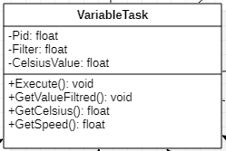

_VariableTask_ - основной класс, который включает в себя следующие задачи, такие как:

1) получение данных с ADC;

2) пересчет данных ADC в значение температуры;

3) отправляет значение температуры на фильтрацию;

4) отправляет отфильтрованное значение в класс PID;

5) запрашивает следующие значения, значение скорости из класса PID и значение отфильтрованной температуры из класса Filter.

Ниже привидён полной код класса _VariableTask_.

[source,c]
----
#pragma once
#include "Temperature.hpp"
#include "thread.hpp"
#include "event.hpp"
#include "IVariable.hpp"
#include "ADC.hpp"
#include "DMA.hpp"
#include "Pid.hpp"
#include "Filter.hpp"
#include <iostream>
#include "Speed.hpp"

template <typename myADC>
class VariableTask : public OsWrapper::Thread<512>
{
private:
  Pid pid;
  Filter filter;
  Temperature TemperatureValue = Temperature((50.0F/4096), 0); //передаём значение в класс Ivariable и фиксируем в переменной TemepatureValue
  Speed SpeedValue = Speed((50.0F/4096), 0);
  OsWrapper::Event& myEvent; // ссылка на событие
  float CelsiusValue = 0.0F;

public:

  void Execute() override
  {
    myADC::adcConfig(Resolution::Bits12, tSampleRate::Cycles480); //настройка АЦП
    myADC::SetChannels(0); //подключение каналов
    myADC::dmaConfig(); //подключение ДМА
    myADC::On(); //включение АЦП
    myADC::Start();

   for( ; ;)
  {
    auto codes = myADC::GetValue(); //запрашиваем значение температуры к codes
    TemperatureValue.Calculation(codes[0]); //рассчитываем значение
    TemperatureValue.GetValueAndName();
    SpeedValue.Calculation(codes[0]); //рассчитываем значение
    SpeedValue.GetValueAndName();
    auto var = filter.Update(TemperatureValue.GetValue()); // запрашиваем в переменной var значение температуры с приминением filter
    auto var1 = pid.Start(SpeedValue.GetValue());
    std::cout<<var<<std::endl;
    Sleep(200ms);
  }
  }

  float GetCelsius()
  {
    return filter.Update(TemperatureValue.GetValue());
  }
  float GetSpeed()
  {
    return pid.Start(SpeedValue.GetValue());
  }
  VariableTask(OsWrapper::Event& event): myEvent(event)
  {}
};
----

=== 5.2 Класс Variable.hpp

.Архитектура класса Variable.hpp
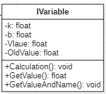

В данном классе принимаются значения температуры, затем расчитываются значения температуры.

Ниже привидён полной код класса _Variable_.

[source,c]
----
#pragma once
#include <array>

class IVariable
{
    protected:
      float Value;
      const float k;
      const float b;

    public:
      IVariable(float k1, float b1): k(k1), b(b1) {}; //создаем метод и передаем k и b
      virtual void Calculation(std::uint32_t code) = 0; //рассчитываем значение температуры
      virtual float GetValue() = 0;
      virtual void GetValueAndName() = 0;
};
----

=== 5.3 Класс LedTask.hpp

.Архитектура класса LedTask.hpp
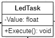

Данный класс забирает значения скорости из класса _VariableTask_ для изменение яркости светодиода при помощи класса _PWM_ и _Led_.

Ниже привидён полной код класса _LedTask_

[source,c]
----
#pragma once
#include "thread.hpp"
#include "VariableTask.hpp"
#include "Led.hpp"

template <auto& VariableTask> // в LedTask дожен передаваться VariableTask
class LedTask : public OsWrapper::Thread<128> //наследуем Thread
{
private:
  float Value;
  Led led; //создали объект типа Led и назвали led
public:
  void Execute() override //виртуальный метод
  {
    for(;;)
    {
    Value = VariableTask.GetSpeed(); //записываем значение температуры в переменную Value
    led.CalculateKuklerDute(Value); //вызываем метод и передаём значение температуры
    led.SetKuklerDute();
    Sleep(50ms); //задержка(ОСРВ)
    }
  }
};
----

=== 5.4 Класс Led.hpp

.Архитектура класса Led.hpp
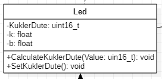

Класс _Led_ используется для описания методов расчета яркости светодиодов, а также содержит в себе метод регулировки яркости, который передается в класс _PWM.hpp_.

Ниже привидён полной код класса _Led_.

[source,c]
----
#pragma once
#include "PWM.hpp"
#include "tim3registers.hpp"

class Led
{
protected:
  uint16_t KuklerDute;
  float k = 600.0F;
  float b = 1550.0F;
  PWM<TIM3> pwm; // в класс PWM передаём 3timer и называем PWM
public:
  void CalculateKuklerDute(uint16_t Value)
  {
    if (Value >= 0.1F)
    {
      KuklerDute = static_cast<uint16_t>(k*static_cast<float>(Value) + b);
    }
    else
      KuklerDute = 0;
  }
  void SetKuklerDute()
  {
    pwm.SetKukler(KuklerDute); //вызываем метод SetKukler
  }
};
----

=== 5.5 Класс PID.hpp

.Архитектура класса PID.hpp
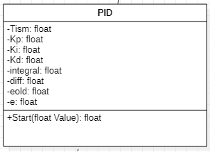

Данный класс необходим для расчёта скорости/яркости вентилятора/светодиода.

Ниже привидён полной код класса _PID_

[source,c]
----
#pragma once
#include "VariableTask.hpp"
#include "Temperature.hpp"

 class Pid

{

public:

 float Start(float Value)

{
    e = -(Tism - Value);
    eold = e;
    integral += e*0.2;
    if(integral<-Kp*e)
    integral = -Kp*e;
    if(integral>100/Ki)
    integral = 100/Ki;
    diff = (e - eold)/0.2;
    Speed = Kp*e+Ki*integral+Kd*diff;
    if(Speed>100) Speed = 100;
    if (Speed < 0) Speed = 0;
    return Speed;
}

private:

    float Tism=23.0;
    float Kp =0.5;
    float Ki=0.2;
    float Kd=0.001;
    float integral = 0;
    float diff = 0;
    float eold;
    float e;
    float Speed;
    float Temperature;

    };
----

=== 5.6 Класс PWM.hpp

.Архитектура класса PWM.hpp
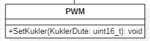

Класс PWM используется для регулировки яркости светодиодов (скорости вентилятора) с помощью ШИМ. Регулировка яркости происходит в зависимости от температуры.

Ниже привидён полной код класса _PWM_

[source,c]
----
#pragma once
#include "gpiocregisters.hpp"
#include "rccregisters.hpp"
#include "tim3registers.hpp"
template <typename Timer> //объявляем таймер из другого файла

class PWM
{
public:
  void SetKukler(uint16_t KuklerDute) // создаем и передаем в метод SetDuty
  {
    Timer::CCR1::Write(KuklerDute);
    Timer::CCR2::Write(KuklerDute);
    Timer::CCR3::Write(KuklerDute);
    Timer::CCR4::Write(KuklerDute);// записываем в регистр CCR3(регистр захвата и сравнивания)
  }
};
----

=== 5.7 Класс ADC.hpp

.Архитектура класса ADC.hpp
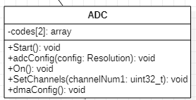

Класс _ADC_ используется для настройки АЦП. Содержит в себе настройки таких параметров, как _Resolution_, _SampleRate_, а также запускает сам АЦП и содержит метод для настройки DMA.

Ниже привидён полной код класса _ADC_

[source,c]
----
#ifndef ADC_HPP
#define ADC_HPP
#include <array>
#include "DMA.hpp"

enum class Resolution //enum - перечисление
{
  Bits12,
  Bits10,
  Bits8,
  Bits6
};

enum class tSampleRate
{
  Cycles3,
  Cycles15,
  Cycles28,
  Cycles56,
  Cycles84,
  Cycles112,
  Cycles144,
  Cycles480
};

using myDMA =  DMA<DMA2>; //передаем DMA DMA2
template<class T> //шаблонный класс
class ADC
{
private:
   static inline std::array<uint32_t, 2> codes; //массив данных АЦП
   static inline std::uint32_t Pcodes = reinterpret_cast<std::uint32_t>(&codes);
public:
  static void Start()
  {
   T::CR2::SWSTART::On::Set(); //начало преобразований
  }

  static void On()
  {
    T::CR2::ADON::Enable::Set(); // включаем ADC1
  }

  static void dmaConfig()
  {
    T::CR2::DMA::Enable::Set(); //включаем DMA
    myDMA::ChannelSet(); //установка канала
    myDMA::DataSizeSet(); //размер данных
    myDMA::DirectionSet(); //установка направлений
    myDMA::TargetSet(T::DR::Address, Pcodes); //установка цели их АЦП в Pcodes
    myDMA::StreamOn(); //включаем поток
  }

  static void adcConfig(Resolution resolution, tSampleRate vsamplerate) //настройка АЦП
  {
    switch(resolution)
    {
      case Resolution::Bits12:
      T::CR1::RES::Bits12::Set();
      break;

      case Resolution::Bits10:
      T::CR1::RES::Bits10::Set();
      break;

      case Resolution::Bits8:
      T::CR1::RES::Bits8::Set();
      break;

      case Resolution::Bits6:
      T::CR1::RES::Bits6::Set();
      break;

      default:
      T::CR1::RES::Bits12::Set();
      break;
    }

    switch(vsamplerate)
    {
      case tSampleRate::Cycles3:
      T::SMPR2::SMP0::Cycles3::Set();
      break;
      case tSampleRate::Cycles15:
      T::SMPR2::SMP0::Cycles15::Set();
      break;
      case tSampleRate::Cycles28:
      T::SMPR2::SMP0::Cycles28::Set();
      break;
      case tSampleRate::Cycles56:
      T::SMPR2::SMP0::Cycles56::Set();
      break;
      case tSampleRate::Cycles84:
      T::SMPR2::SMP0::Cycles84::Set();
      break;
      case tSampleRate::Cycles112:
      T::SMPR2::SMP0::Cycles112::Set();
      break;
      case tSampleRate::Cycles480:
      T::SMPR2::SMP0::Cycles480::Set();
      break;

      default:
      T::SMPR2::SMP0::Cycles480::Set();
      break;
    }
  }

  static void SetChannels (std::uint32_t channelNum1)
  {
    T::SQR1::L::Conversions16::Set();//кол-во измерений
    T::CR1::SCAN::Enable::Set();//сканирование
    T::CR2::EOCS::SequenceConversion::Set(); //установка режима одиночого преобразования в регистр
    T::CR2::CONT::ContinuousConversion::Set();
    assert(channelNum1<19);
    T::SQR3::SQ1::Set(channelNum1); //установка канала для измерений
    T::CR2::DDS::DMARequest::Set(); //запрос на использование DMA
  }

  static std::array<uint32_t, 2>& GetValue()
  {
    return codes;
  }
};

#endif
----

=== 5.8 Класс Usart.hpp

.Архитектура класса Usart.hpp
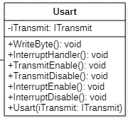

Данный класс отвечает за хранение, запись и разрешает отправку данных.

Ниже привидён полной код класса _Usart_

[source,c]
----
#pragma once
#include "usart2registers.hpp" //for usart2registers
#include "usartdriver.hpp" //for USARTDriver
template<typename TUSARTReg>

class Usart
{
  public:
  Usart(ITransmit& aITransmit): iTransmit(aITransmit) //хранит ссылки на объект класса iTransmit.
    {
    }

   static void WriteByte(std::uint8_t byte) // записывает данные в регистр DR.
  {
    TUSARTReg::DR::Write(byte);
  }

    void InterruptHandler() //проверяет флаги: Пуст ли регистр данных и разрешено ли направление по передачи. Затем вызываем метод OnNextByteTransmit() интерфейса iTransmit
  {
    if(TUSARTReg::SR::TXE::DataRegisterEmpty::IsSet() &&  TUSARTReg::CR1::TXEIE::InterruptWhenTXE::IsSet())
    {
      iTransmit.OnNextByteTransmit();
    }
  }

   static void TransmitEnable() // включают передачу данных
  {
    TUSARTReg::CR1::TE::Enable::Set();
  }

   static void InterruptEnable() //разрешают прерываение до преедачи
  {
    TUSARTReg::CR1::TXEIE::InterruptWhenTXE::Set();
  }

   static void InterruptDisable() // запрашивают передачу данных
  {
    TUSARTReg::CR1::TXEIE::InterruptInhibited::Set();
  }

   static void TransmitDisable() // включают передачу данных
  {
    TUSARTReg::CR1::RE::Disable::Set();
  }

private:
  ITransmit& iTransmit;
};
----

=== 5.9 Класс USARTTask.hpp

.Архитектура класса USARTTask.hpp
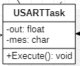

Класс является активной задачей.
Отвечает за передачу значений температуры и скорости по _USART_.

Ниже привидён полной код класса _USARTTask_.

[source,c]
----
#pragma once

#include "thread.hpp"//for thread
#include "usartconfig.hpp"
#include <stdio.h> //for sprintf
using namespace OsWrapper;

template<auto& myVariableTask>
class USARTTask: public Thread<512>
{
public:

  void Execute() // отвечает за передачу значений по USART
  {
   for(;;)
    {
   out = myVariableTask.GetCelsius(); //хранит строку со значением температуры
   out1 = myVariableTask.GetSpeed(); // хранит строку со значением скорости
   sprintf(mes, "Temperature = %1.2f C " , out);//отправляет строку со значением температуры
   sprintf(mes1, "Speed = %1.1f %\n ", out1);//отправляет строку со значением скорости
   usartDriver.SendMessage(mes, strlen(mes));
   Sleep (500ms);
   usartDriver.SendMessage(mes1, strlen(mes1));
   Sleep (250ms);

    }
         }

private:
  float out;
   float out1;
  char mes[30]; // хранит сформированную строку для отправки со значением температуры
  char mes1[30]; // хранит сформированную строку для отправки со значением скорости
};
----

=== 5.10 Класс Filter.hpp

.Архитектура класса Filter.hpp
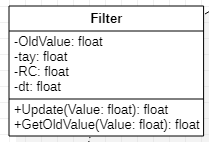

Данный класс _Filter_ овечает за фильтрацию значений температуры.

Ниже привидён полной код класса _Filter_.

[source,c]
----
#pragma once
#include <cmath>

class Filter
{
  private:
  float OldValue = 0.0f; //объявляем переменную
  static constexpr float dt = 200.0f;
  static constexpr float RC = 100.0f;
  inline static const float tay = 1.0f - exp(-dt/RC);

  public:
  float Update(float Value)//создали класс и передаем в него значение температуры
  {
    float FilteredValue = OldValue + (Value - OldValue)*tay;
    OldValue = FilteredValue;
    return FilteredValue;
  }
  float GetOldValue (float Value)
  {
    float FilteredValue = OldValue + (Value - OldValue)*tay;
    OldValue = FilteredValue;
    return FilteredValue;
  }
};
----

=== 5.11 Класс Temperature.hpp

.Архитектура класса Temperature.hpp
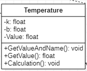

Класс _Temperature_ используется для расчёта и периёма значений температуры.

Ниже привидён полной код класса _Temperature_

[source,c]
----
#pragma once
#include "Filter.hpp"
#include <array>
#include "IVariable.hpp"

class Temperature : public IVariable
{
public:
  using IVariable::IVariable; //объявляет кампилятору что мы будем использовать объект IVariable из пространства имен IVariable
  void Calculation(std::uint32_t code) override //описываем метод из IVariable
  {
    Value = k*code + b;
  }
   float GetValue() override
  {
    return Value;
  }
  void GetValueAndName() override
  {
  }
};
----

=== 5.12 Класс main.cpp

В данном классе производится настройка всех задействованных портов, а также производится запуск задач.

Первым шагом является подача тактирования на нужные порты.

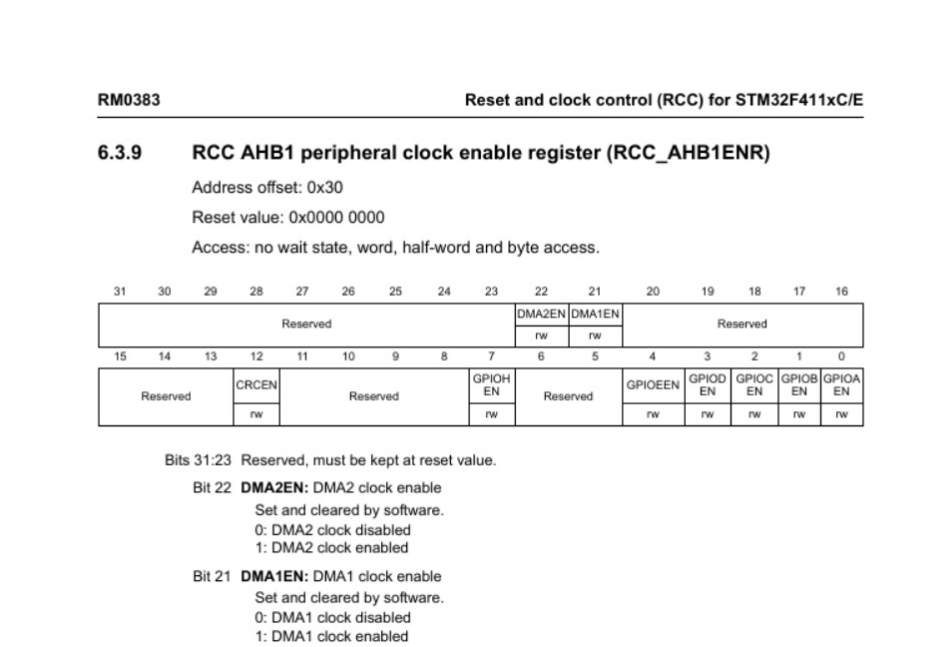
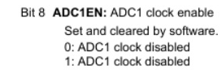
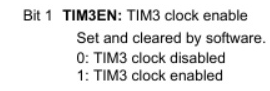
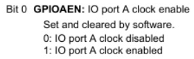

Далее нужно назначить каналы таймеров. Данная настройка производится с помощью реигстров AFRL (для портов с номером от 0 до 7) и AFRH (для портов с номером от 8 до 15).

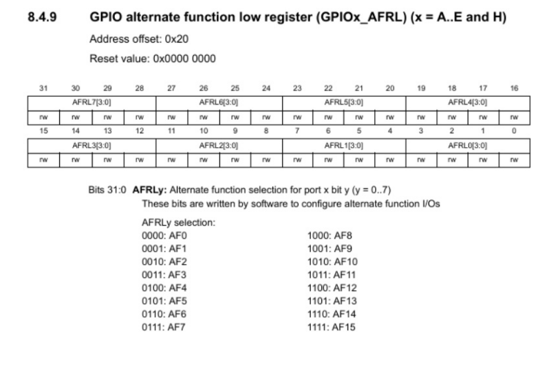
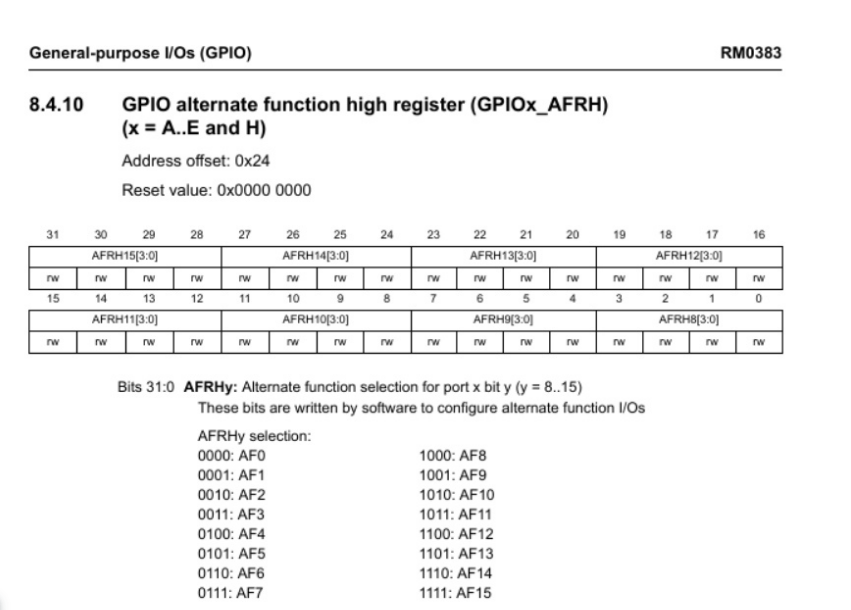

Далее нужно настроить ШИМ. Для этого сначала устанавливается захват на 1 канал.

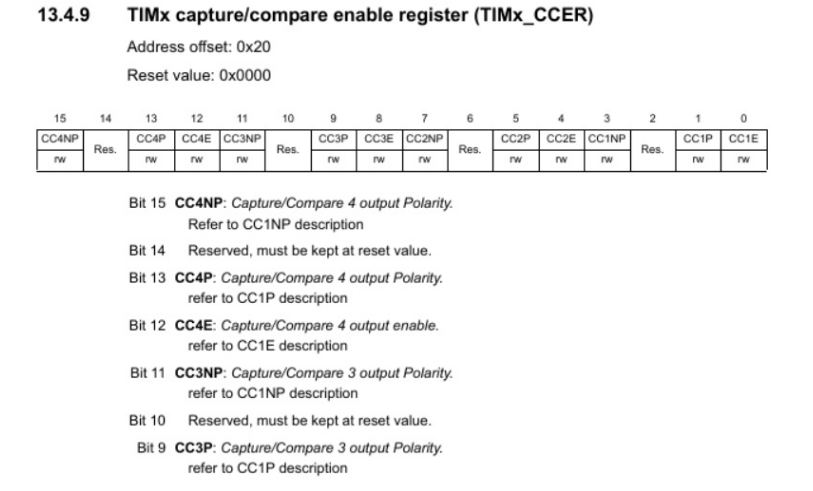

После этого включается ШИМ, а также предварительная загрузка.

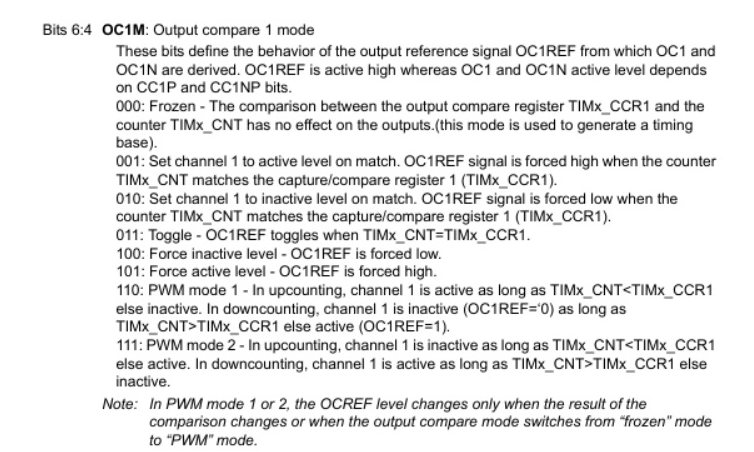

Далее запускаем третий таймер.

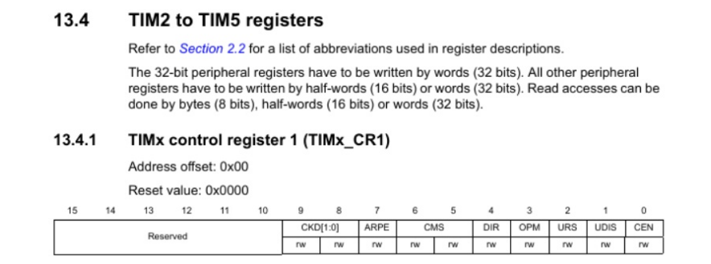

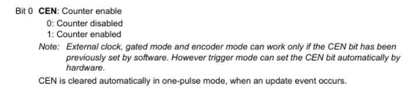

Ниже приведён полный код класса main.cpp

[source,c]
----
#include "rtos.hpp"         // for Rtos
#include "event.hpp"        // for Event
#include "rccregisters.hpp" // for RCC
#include "gpioaregisters.hpp"  //for Gpioa
#include "gpiocregisters.hpp"  //for Gpioc
#include "adc1registers.hpp" //for ADC1
#include "susudefs.hpp"
#include "thread.hpp"
#include "nvicregisters.hpp"   //for NVIC
//Vetka VariableTask
#include "VariableTask.hpp"
#include "ADC.hpp" //for ADC
#include "adccommonregisters.hpp" //for ADCCommon
#include "IVariable.hpp"
#include "Temperature.hpp"
//Vetka LedTask
#include "LedTask.hpp"
#include "Led.hpp"
#include "PWM.hpp"
#include "USARTTask.hpp"//for USARTTask
std::uint32_t SystemCoreClock = 16'000'000U;
constexpr std::uint32_t UartSpeed9600 = std::uint32_t(16000000U / 9600U);
extern "C"
{
    int __low_level_init(void)
    {
      //включение внешнего генератора на 16МГц
      RCC::CR::HSION::On::Set();
      while (RCC::CR::HSIRDY::NotReady::IsSet())
      {
      }
      //Переключение системных часов на внешний генератор
      RCC::CFGR::SW::Hsi::Set();
      while (!RCC::CFGR::SWS::Hsi::IsSet())
      {
      }

      RCC::APB2ENR::SYSCFGEN::Enable::Set(); // включение APB линии
      // настройка тактирования
      RCC::CR::HSEON::On::Set();
      RCC::CFGR::SW::Hse::Set();
      RCC::APB1ENR::TIM3EN::Enable::Set();
      RCC::APB2ENR::ADC1EN::Enable::Set(); // тактирование на АЦП
      ADC_Common::CCR::TSVREFE::Enable::Set();
      RCC::AHB1ENR::DMA2EN::Enable::Set(); // тактирование на ДМА
      RCC::AHB1ENR::GPIOCEN::Enable::Set();// тактирование на порт С
      RCC::AHB1ENR::GPIOAEN::Enable::Set();// тактирование на порт А
      GPIOA::MODER::MODER0::Analog::Set(); //Порт А0 устанавливаем в аналоговый режим
          // настройка порта А0
      GPIOA::OSPEEDR::OSPEEDR0::LowSpeed::Set(); //порт А0 устанавливаем на низкую скорость
      GPIOA::PUPDR::PUPDR0::PullUp::Set(); //
      GPIOA::OTYPER::OT0::OutputPushPull::Set(); //
      GPIOA::MODER::MODER0::Analog::Set(); //
      GPIOC::MODER::MODER8::Alternate::Set();//порт С8 устанавливаем в альтернативный режим

      GPIOC::AFRH::AFRH8::Af2::Set(); // TIM3_3Kanal

      // настройка PWM
      TIM3::CCER::CC3E::Value1::Set(); //установка регистра захвата
      // обратный PWM
      TIM3::CCMR2_Output::OC3M::Value6::Set();// PWM режим
      TIM3::CCMR2_Output::OC3PE::Value1::Set();//регистр предварительной загрузки
      TIM3::CR1::ARPE::Value1::Set(); //включение предварительной загрузки с автоматической перезагрузкой
      // запуск TIM3
      TIM3::CR1::CEN::Value1::Set(); //запуск таймера
      //данные для  TIM3 CCR

      RCC::APB1ENRPack< //задаем тактирование на таймер
        RCC::APB1ENR::TIM2EN::Enable,
        RCC::APB1ENR::USART2EN::Enable
        >::Set() ;

      GPIOA::MODERPack<
        GPIOA::MODER::MODER2::Alternate, // Uart2 TX
        GPIOA::MODER::MODER3::Alternate  // Uart2 RX
        >::Set() ;

      GPIOA::AFRLPack <
        GPIOA::AFRL::AFRL2::Af7, // Uart2 TX
        GPIOA::AFRL::AFRL3::Af7  // Uart2 RX
        >::Set() ;

        USART2::BRR::Write(UartSpeed9600); //записываем значение скорости
        USART2::CR1::UE::Enable::Set(); //включить  USART
        NVIC::ISER1::Write(1<<6); //глобальное прерывание
      return 1;
    }
}

Event event(1000ms, 1);
using myADC = ADC<ADC1>;
VariableTask<myADC> myVariableTask(event); //создали объект
LedTask<myVariableTask> myLedTask;
USARTTask<myVariableTask> USARTtask;

int main()
{
  //задачи для OCRB
  using namespace OsWrapper;
  Rtos::CreateThread(myVariableTask, "Execute", ThreadPriority::normal);
  Rtos::CreateThread(myLedTask, "Execute", ThreadPriority::normal);
  Rtos::CreateThread(USARTtask, "Execute", ThreadPriority::normal);
  //Rtos::CreateThread(USARTtask, "Execute1", ThreadPriority::normal);
  Rtos::Start();
  return 0;
}
----

== Резульатат проделанного курсового проекта
Резульатат проделанного курсового проекта представлен на рисунке 18.

.Результат проделанной работы
image::img-e6281_0oivxHAb (1).gif[]

== Демонcтрация работы устройства

Вывод в Terminal показана на рисунках 19 и 20.

.Вывод в Terminal
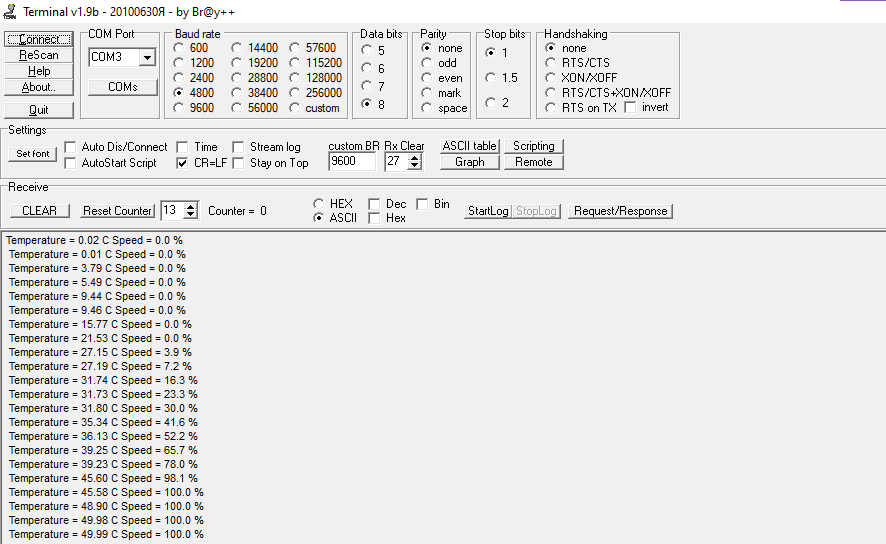

.График зависимости скорости от температуры
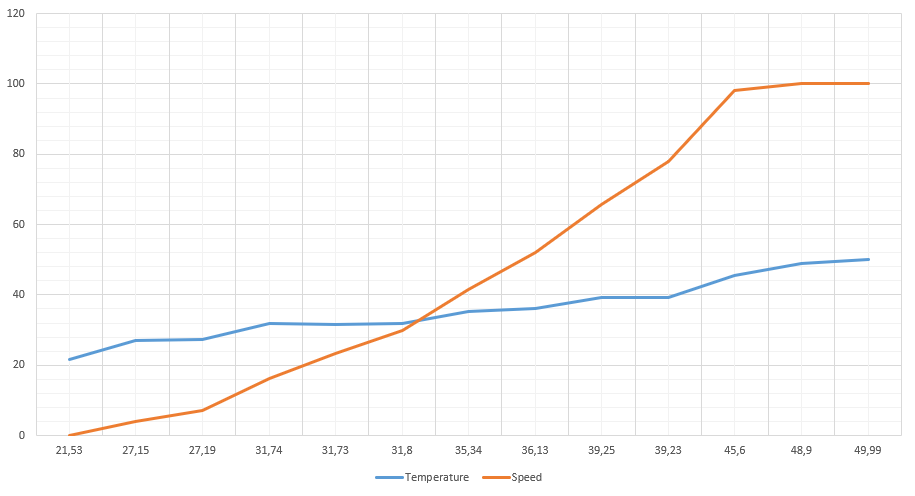

.Вывод в Terminal
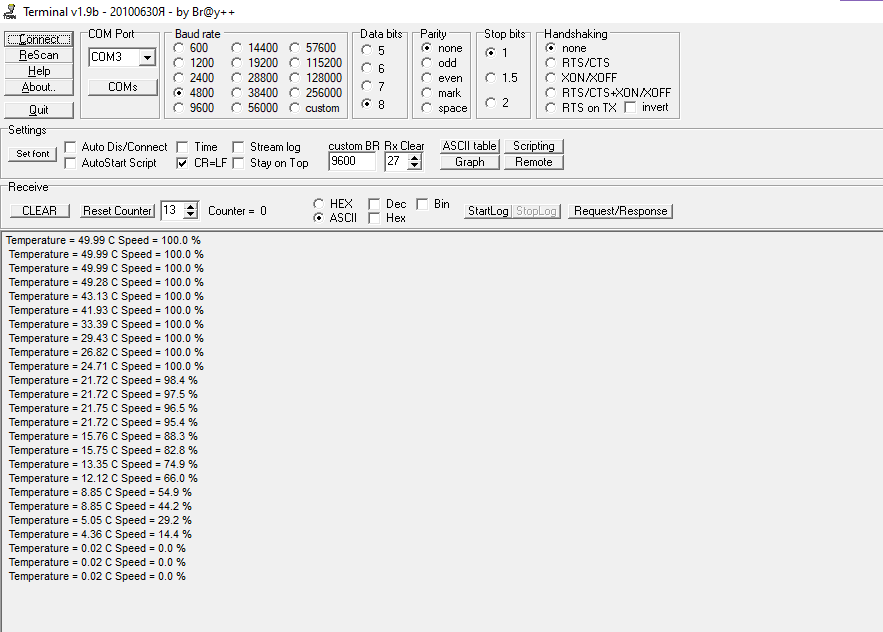

.График зависимости скорости от температуры
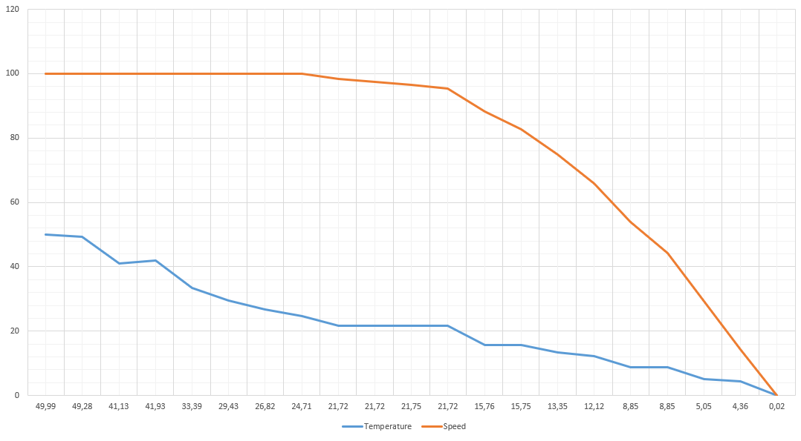

== Заключение

В ходе работы было разработано устройство активной системы охлаждения с выводом температуры и скорости вращения вентилятора в Terminal.
